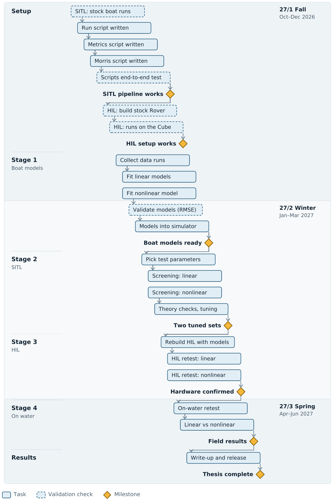

[README (1).md](https://github.com/user-attachments/files/32980100/README.1.md)
# Tuning ArduPilot Speed and Heading Control for Small Unmanned Surface Vehicles

 Platform: Pro Boat Blackjack 42 running ArduPilot Rover on a Cube Orange+. Target completion: June 2027.

## Research plan

- **[Thesis overview](Thesis_Overview.pdf)**: problem, research questions, expected contributions, and research plan ([Word version](Thesis_Overview.docx)).
- **[Interactive research plan](https://rgc09.github.io/USV-Thesis-Plan/)**: click any step in the flowchart to see what it involves and why it is needed.

| Quarter | Months | Main work |
|---|---|---|
| 27/1 Fall | Oct–Dec 2026 | Setup (SITL, scripts, HIL build), Stage 1 data runs and model fits |
| 27/2 Winter | Jan–Mar 2027 | Model validation, Stage 2 screening and tuning, Stage 3 HIL |
| 27/3 Spring | Apr–Jun 2027 | Stage 4 on-water tests and comparison, write-up |
